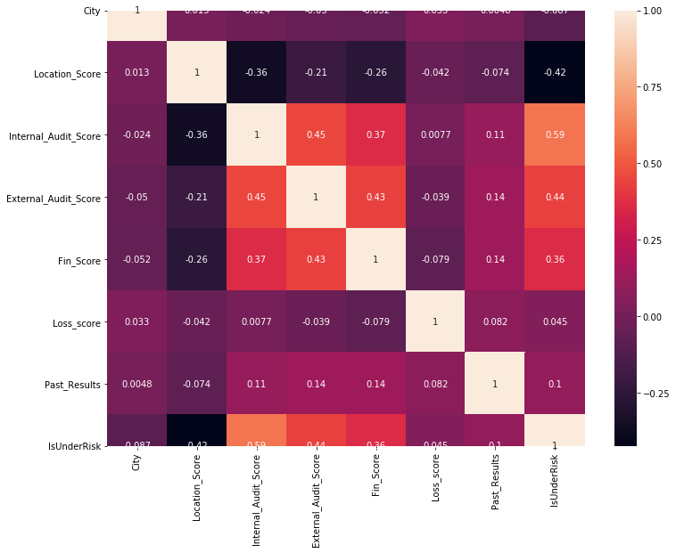
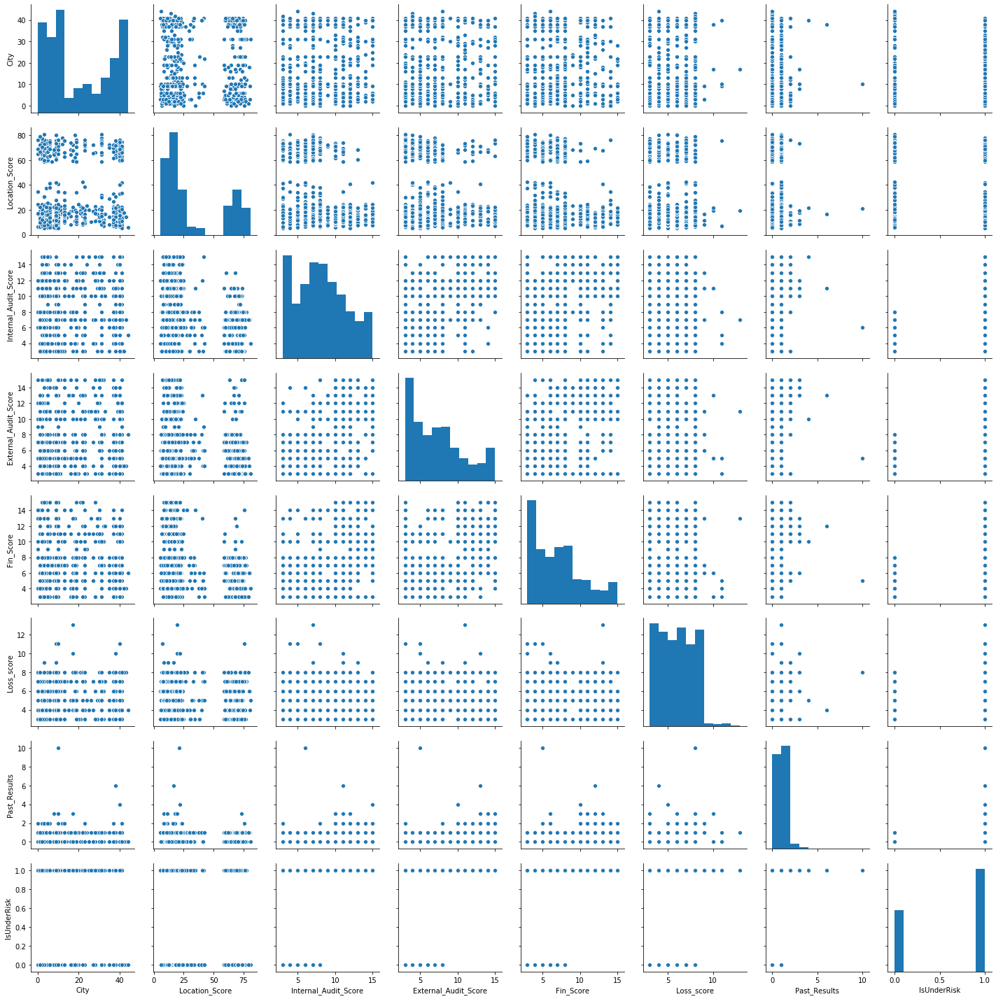
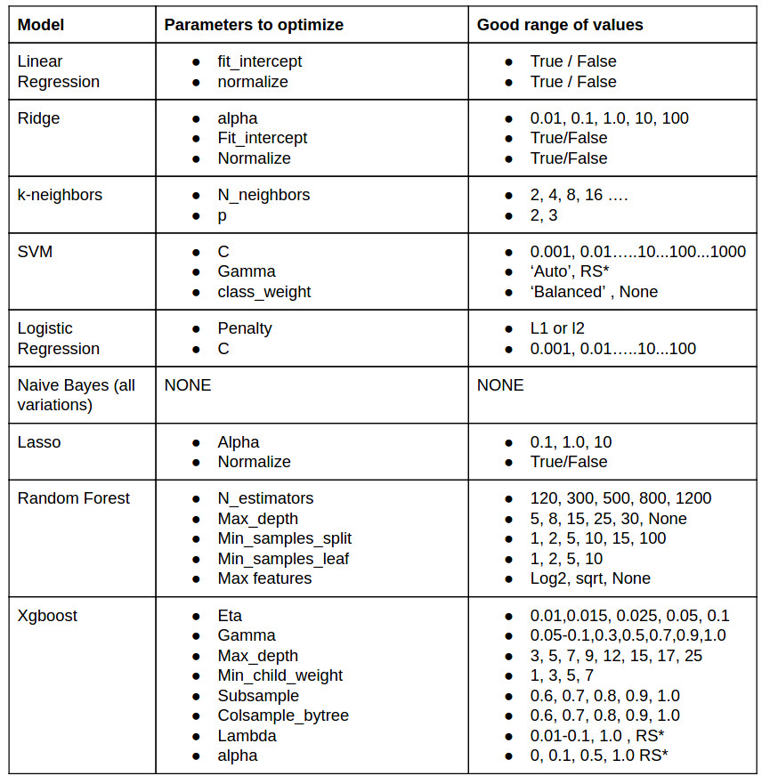
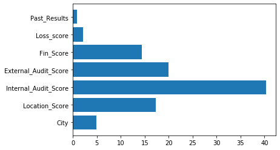
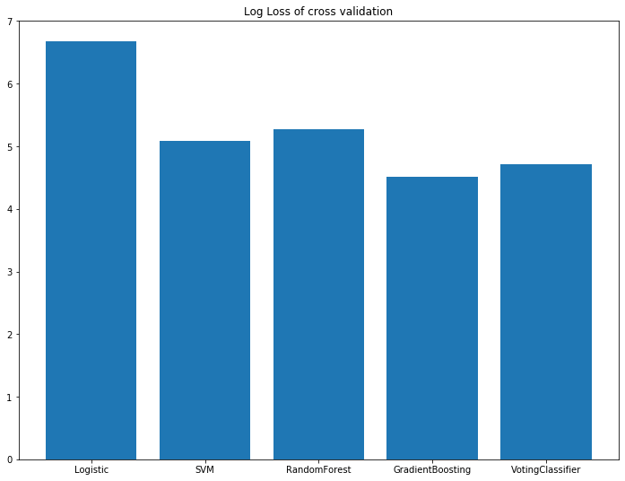

# Financial Risk Prediction : Weekend Hackathon - 5 Rank-161

This notebook contains the following sections:
1. Data Understanding
2. Data Exploration
3. Model Building
4. Hyperparamater tuning
5. Final submission

# Data Understanding


```python
import numpy as np
import pandas as pd
import matplotlib.pyplot as plt
import seaborn as sns
```


```python
raw_train=pd.read_csv('./Financial_Risk_Participants_Data/Train.csv')
raw_train.head()
```


<div>
<style scoped>
    .dataframe tbody tr th:only-of-type {
        vertical-align: middle;
    }

    .dataframe tbody tr th {
        vertical-align: top;
    }

    .dataframe thead th {
        text-align: right;
    }
</style>
<table border="1" class="dataframe">
  <thead>
    <tr style="text-align: right;">
      <th></th>
      <th>City</th>
      <th>Location_Score</th>
      <th>Internal_Audit_Score</th>
      <th>External_Audit_Score</th>
      <th>Fin_Score</th>
      <th>Loss_score</th>
      <th>Past_Results</th>
      <th>IsUnderRisk</th>
    </tr>
  </thead>
  <tbody>
    <tr>
      <th>0</th>
      <td>2</td>
      <td>8.032</td>
      <td>14</td>
      <td>8</td>
      <td>3</td>
      <td>6</td>
      <td>0</td>
      <td>1</td>
    </tr>
    <tr>
      <th>1</th>
      <td>31</td>
      <td>77.730</td>
      <td>8</td>
      <td>3</td>
      <td>3</td>
      <td>8</td>
      <td>1</td>
      <td>0</td>
    </tr>
    <tr>
      <th>2</th>
      <td>40</td>
      <td>59.203</td>
      <td>3</td>
      <td>12</td>
      <td>11</td>
      <td>3</td>
      <td>0</td>
      <td>1</td>
    </tr>
    <tr>
      <th>3</th>
      <td>12</td>
      <td>73.080</td>
      <td>4</td>
      <td>5</td>
      <td>7</td>
      <td>6</td>
      <td>0</td>
      <td>0</td>
    </tr>
    <tr>
      <th>4</th>
      <td>4</td>
      <td>15.666</td>
      <td>13</td>
      <td>15</td>
      <td>6</td>
      <td>7</td>
      <td>2</td>
      <td>1</td>
    </tr>
  </tbody>
</table>
</div>


```python
raw_test=pd.read_csv('./Financial_Risk_Participants_Data/Test.csv')
raw_test.head()
```


<div>
<style scoped>
    .dataframe tbody tr th:only-of-type {
        vertical-align: middle;
    }

    .dataframe tbody tr th {
        vertical-align: top;
    }

    .dataframe thead th {
        text-align: right;
    }
</style>
<table border="1" class="dataframe">
  <thead>
    <tr style="text-align: right;">
      <th></th>
      <th>City</th>
      <th>Location_Score</th>
      <th>Internal_Audit_Score</th>
      <th>External_Audit_Score</th>
      <th>Fin_Score</th>
      <th>Loss_score</th>
      <th>Past_Results</th>
    </tr>
  </thead>
  <tbody>
    <tr>
      <th>0</th>
      <td>41</td>
      <td>18.272</td>
      <td>13</td>
      <td>12</td>
      <td>9</td>
      <td>7</td>
      <td>0</td>
    </tr>
    <tr>
      <th>1</th>
      <td>17</td>
      <td>64.799</td>
      <td>6</td>
      <td>10</td>
      <td>7</td>
      <td>4</td>
      <td>1</td>
    </tr>
    <tr>
      <th>2</th>
      <td>31</td>
      <td>68.890</td>
      <td>3</td>
      <td>3</td>
      <td>7</td>
      <td>8</td>
      <td>0</td>
    </tr>
    <tr>
      <th>3</th>
      <td>3</td>
      <td>16.492</td>
      <td>15</td>
      <td>10</td>
      <td>7</td>
      <td>4</td>
      <td>1</td>
    </tr>
    <tr>
      <th>4</th>
      <td>9</td>
      <td>17.178</td>
      <td>7</td>
      <td>3</td>
      <td>8</td>
      <td>3</td>
      <td>1</td>
    </tr>
  </tbody>
</table>
</div>


```python
raw_train.shape
```


    (543, 8)


```python
raw_train.isnull().sum()
```


    City                    0
    Location_Score          0
    Internal_Audit_Score    0
    External_Audit_Score    0
    Fin_Score               0
    Loss_score              0
    Past_Results            0
    IsUnderRisk             0
    dtype: int64


```python
raw_train.info()
```

    <class 'pandas.core.frame.DataFrame'>
    RangeIndex: 543 entries, 0 to 542
    Data columns (total 8 columns):
    City                    543 non-null int64
    Location_Score          543 non-null float64
    Internal_Audit_Score    543 non-null int64
    External_Audit_Score    543 non-null int64
    Fin_Score               543 non-null int64
    Loss_score              543 non-null int64
    Past_Results            543 non-null int64
    IsUnderRisk             543 non-null int64
    dtypes: float64(1), int64(7)
    memory usage: 34.0 KB
    

# Data Exploration


```python
plt.figure(figsize=(12,9))
sns.heatmap(raw_train.corr(),annot=True)
plt.show()
```





```python
discrete = [var for var in raw_train.columns if raw_train[var].dtype!='O' and var!='IsUnderRisk' and raw_train[var].nunique()<10]
continuous = [var for var in raw_train.columns if raw_train[var].dtype!='O' and var!='IsUnderRisk' and var not in discrete]


# categorical
categorical = [var for var in raw_train.columns if raw_train[var].dtype=='O']

print('There are {} discrete variables'.format(len(discrete)))
print('There are {} continuous variables'.format(len(continuous)))
print('There are {} categorical variables'.format(len(categorical)))
```

    There are 1 discrete variables
    There are 6 continuous variables
    There are 0 categorical variables
    


```python
discrete
```


    ['Past_Results']


```python
continuous
```


    ['City',
     'Location_Score',
     'Internal_Audit_Score',
     'External_Audit_Score',
     'Fin_Score',
     'Loss_score']


```python
plt.figure(figsize=(12,9))
sns.pairplot(raw_train)
plt.show()
```


    <Figure size 864x648 with 0 Axes>





## Function for submission


```python
def sub_file(filename,preds):
    sub_df=pd.DataFrame(preds,columns=['0','1'])
    sub_df.to_excel(filename,index=False)
    print(sub_df.head())
```

# Model Building


```python
X=raw_train.drop('IsUnderRisk',axis=1)
y=raw_train.IsUnderRisk
```


```python
from sklearn.linear_model import LogisticRegression
from sklearn.svm import SVC
from sklearn.ensemble import RandomForestClassifier,GradientBoostingClassifier, AdaBoostClassifier,VotingClassifier
from sklearn.tree import DecisionTreeClassifier,plot_tree
from xgboost import XGBClassifier
from sklearn.metrics import confusion_matrix,accuracy_score,roc_auc_score,log_loss,make_scorer
from sklearn.model_selection import train_test_split, cross_val_score,GridSearchCV, RandomizedSearchCV
```


```python
log_loss_scorer=make_scorer(log_loss)
```


```python
def build_model(model,X,y):
    X_train,X_test,y_train,y_test=train_test_split(X,y,test_size=0.2,random_state=1,stratify=y)
    model.fit(X_train,y_train)
    y_pred=model.predict(X_test)
    y_train_pred=model.predict(X_train)
    print("Training Log Loss: : ",log_loss(y_train,y_train_pred))
    print("Testing  Log Loss: : ",log_loss(y_test,y_pred))
    print("Training accuracy: : ",accuracy_score(y_train,y_train_pred))
    print("Testing  accuracy: : ",accuracy_score(y_test,y_pred))
    print(confusion_matrix(y_test,y_pred))
    cv_results=cross_val_score(model,X,y,cv=10,n_jobs=-1,scoring=log_loss_scorer)
    print("Cross validation Log Loss:", cv_results.mean())
```



## 1. LogisticRegression

### Model building


```python
from sklearn.preprocessing import StandardScaler
std=StandardScaler()
X_std=std.fit_transform(X)
lr=LogisticRegression()
build_model(lr,X_std,y)
```

    Training Log Loss: :  6.36666658039777
    Testing  Log Loss: :  4.4362171294801
    Training accuracy: :  0.815668202764977
    Testing  accuracy: :  0.8715596330275229
    [[35  6]
     [ 8 60]]
    Cross validation Log Loss: 6.67873178982795
    

### Hyperparameter Tuning


```python
lr_params={
    "penalty":['l1','l2'],
    "C":[0.001,0.01,0.1,1,10,100]
}
```


```python
lr_grid=GridSearchCV(estimator=lr,
                    param_grid=lr_params,
                    cv=10,verbose=2,n_jobs=-1)
```


```python
lr_grid.fit(X_std,y)
```

    Fitting 10 folds for each of 12 candidates, totalling 120 fits
    

    [Parallel(n_jobs=-1)]: Using backend LokyBackend with 4 concurrent workers.
    [Parallel(n_jobs=-1)]: Done  33 tasks      | elapsed:    6.8s
    [Parallel(n_jobs=-1)]: Done 120 out of 120 | elapsed:    7.5s finished
    


    GridSearchCV(cv=10, error_score=nan,
                 estimator=LogisticRegression(C=1.0, class_weight=None, dual=False,
                                              fit_intercept=True,
                                              intercept_scaling=1, l1_ratio=None,
                                              max_iter=100, multi_class='auto',
                                              n_jobs=None, penalty='l2',
                                              random_state=None, solver='lbfgs',
                                              tol=0.0001, verbose=0,
                                              warm_start=False),
                 iid='deprecated', n_jobs=-1,
                 param_grid={'C': [0.001, 0.01, 0.1, 1, 10, 100],
                             'penalty': ['l1', 'l2']},
                 pre_dispatch='2*n_jobs', refit=True, return_train_score=False,
                 scoring=None, verbose=2)


```python
print("Grid_search best score:",lr_grid.best_score_)
```

    Grid_search best score: 0.8067676767676769
    


```python
lr_grid.best_params_
```


    {'C': 0.01, 'penalty': 'l2'}


```python
build_model(lr_grid.best_estimator_,X,y)
```

    Training Log Loss: :  6.685000001537178
    Testing  Log Loss: :  5.069963481656719
    Training accuracy: :  0.8064516129032258
    Testing  accuracy: :  0.8532110091743119
    [[34  7]
     [ 9 59]]
    Cross validation Log Loss: 6.486852633294605
    

## 2. SVM

### Model building


```python
std=StandardScaler()
X_std=std.fit_transform(X)
svc=SVC(probability=True)
build_model(svc,X_std,y)
```

    Training Log Loss: :  4.377059668396568
    Testing  Log Loss: :  4.4361951222113785
    Training accuracy: :  0.8732718894009217
    Testing  accuracy: :  0.8715596330275229
    [[38  3]
     [11 57]]
    Cross validation Log Loss: 5.090145364653574
    

### Hyperparamter tuning


```python
svc_params={
    "C":[0.001,0.01,0.1,1,10,100,1000],
    "gamma":['auto','scale'],
    "class_weight":['balanced',None]
}

svc_grid=GridSearchCV(estimator=svc,
                    param_grid=svc_params,
                    cv=10,verbose=2,n_jobs=-1)
```


```python
svc_grid.fit(X_std,y)
```

    Fitting 10 folds for each of 28 candidates, totalling 280 fits
    

    [Parallel(n_jobs=-1)]: Using backend LokyBackend with 4 concurrent workers.
    [Parallel(n_jobs=-1)]: Done  58 tasks      | elapsed:    2.0s
    [Parallel(n_jobs=-1)]: Done 280 out of 280 | elapsed:   11.4s finished
    


    GridSearchCV(cv=10, error_score=nan,
                 estimator=SVC(C=1.0, break_ties=False, cache_size=200,
                               class_weight=None, coef0=0.0,
                               decision_function_shape='ovr', degree=3,
                               gamma='scale', kernel='rbf', max_iter=-1,
                               probability=True, random_state=None, shrinking=True,
                               tol=0.001, verbose=False),
                 iid='deprecated', n_jobs=-1,
                 param_grid={'C': [0.001, 0.01, 0.1, 1, 10, 100, 1000],
                             'class_weight': ['balanced', None],
                             'gamma': ['auto', 'scale']},
                 pre_dispatch='2*n_jobs', refit=True, return_train_score=False,
                 scoring=None, verbose=2)


```python
svc_grid.best_score_
```


    0.8636363636363636


```python
svc_grid.best_params_
```


    {'C': 10, 'class_weight': 'balanced', 'gamma': 'auto'}


```python
build_model(svc_grid.best_estimator_,X_std,y)
```

    Training Log Loss: :  3.103722299058151
    Testing  Log Loss: :  4.436187786455138
    Training accuracy: :  0.9101382488479263
    Testing  accuracy: :  0.8715596330275229
    [[39  2]
     [12 56]]
    Cross validation Log Loss: 4.709853740451932
    

## 3. RandomForestClassifier

### Model Building


```python
rf=RandomForestClassifier()
build_model(rf,X,y)
```

    Training Log Loss: :  9.992007221626413e-16
    Testing  Log Loss: :  3.4855792618245687
    Training accuracy: :  1.0
    Testing  accuracy: :  0.8990825688073395
    [[39  2]
     [ 9 59]]
    Cross validation Log Loss: 5.2785444787755615
    

### Hyperparameter tuning


```python
rf_params={
    "n_estimators":[120,300,500,800,1200],
    "max_depth":[5,8,15,25,30,None],
    "min_samples_split":[1,2,5,10,15,None],
    "min_samples_leaf":[1,2,5,10],
    "max_features":["log2","sqrt",None]
}
```


```python
rf_random=RandomizedSearchCV(estimator=rf,
                            param_distributions=rf_params,
                            n_iter=50,cv=10,verbose=2,random_state=4,n_jobs=-1)
```


```python
rf_random.fit(X,y)
```

    Fitting 10 folds for each of 50 candidates, totalling 500 fits
    

    [Parallel(n_jobs=-1)]: Using backend LokyBackend with 4 concurrent workers.
    [Parallel(n_jobs=-1)]: Done  33 tasks      | elapsed:   51.3s
    [Parallel(n_jobs=-1)]: Done 154 tasks      | elapsed:  2.3min
    [Parallel(n_jobs=-1)]: Done 357 tasks      | elapsed:  4.3min
    [Parallel(n_jobs=-1)]: Done 500 out of 500 | elapsed:  5.8min finished
    


    RandomizedSearchCV(cv=10, error_score=nan,
                       estimator=RandomForestClassifier(bootstrap=True,
                                                        ccp_alpha=0.0,
                                                        class_weight=None,
                                                        criterion='gini',
                                                        max_depth=None,
                                                        max_features='auto',
                                                        max_leaf_nodes=None,
                                                        max_samples=None,
                                                        min_impurity_decrease=0.0,
                                                        min_impurity_split=None,
                                                        min_samples_leaf=1,
                                                        min_samples_split=2,
                                                        min_weight_fraction_leaf=0.0,
                                                        n_estimators=100,
                                                        n_job...
                                                        warm_start=False),
                       iid='deprecated', n_iter=50, n_jobs=-1,
                       param_distributions={'max_depth': [5, 8, 15, 25, 30, None],
                                            'max_features': ['log2', 'sqrt', None],
                                            'min_samples_leaf': [1, 2, 5, 10],
                                            'min_samples_split': [1, 2, 5, 10, 15,
                                                                  None],
                                            'n_estimators': [120, 300, 500, 800,
                                                             1200]},
                       pre_dispatch='2*n_jobs', random_state=4, refit=True,
                       return_train_score=False, scoring=None, verbose=2)


```python
rf_random.best_score_
```


    0.861919191919192


```python
rf_random.best_params_
```


    {'n_estimators': 500,
     'min_samples_split': 2,
     'min_samples_leaf': 2,
     'max_features': 'sqrt',
     'max_depth': 5}


```python
build_model(rf_random.best_estimator_,X,y)
```

    Training Log Loss: :  3.342469601327119
    Testing  Log Loss: :  4.1193256140011885
    Training accuracy: :  0.9032258064516129
    Testing  accuracy: :  0.8807339449541285
    [[38  3]
     [10 58]]
    Cross validation Log Loss: 4.831973690775467
    


```python
plt.barh(y=X.columns,width=rf_random.best_estimator_.feature_importances_*100)
```


    <BarContainer object of 7 artists>





## 4. GradientBoosting Classifier


```python
gb=GradientBoostingClassifier()
build_model(gb,X,y)
```

    Training Log Loss: :  1.3529087490857206
    Testing  Log Loss: :  3.4855865975808085
    Training accuracy: :  0.9608294930875576
    Testing  accuracy: :  0.8990825688073395
    [[38  3]
     [ 8 60]]
    Cross validation Log Loss: 4.516827815637886
    


```python
gb.get_params()
```


    {'ccp_alpha': 0.0,
     'criterion': 'friedman_mse',
     'init': None,
     'learning_rate': 0.1,
     'loss': 'deviance',
     'max_depth': 3,
     'max_features': None,
     'max_leaf_nodes': None,
     'min_impurity_decrease': 0.0,
     'min_impurity_split': None,
     'min_samples_leaf': 1,
     'min_samples_split': 2,
     'min_weight_fraction_leaf': 0.0,
     'n_estimators': 100,
     'n_iter_no_change': None,
     'presort': 'deprecated',
     'random_state': None,
     'subsample': 1.0,
     'tol': 0.0001,
     'validation_fraction': 0.1,
     'verbose': 0,
     'warm_start': False}


```python
gb_params={
    "learning_rate":[0.01,0.015,0.025,0.05,0.1],
    "max_depth":[3,5,7,9,12,14],
    "subsample":[0.6,0.7,0.8,0.9,1.0],
    "min_samples_split":[1,2,5,10,15,None],
    "min_samples_leaf":[1,2,5,10],
    "max_features":["log2","sqrt",None],
    "n_estimators":[120,300,500,800,1200],
}
```


```python
gb_random=RandomizedSearchCV(estimator=gb,
                            param_distributions=gb_params,
                            n_iter=25,cv=10,verbose=2,random_state=4,n_jobs=-1)
```


```python
gb_random.fit(X,y)
```

    Fitting 10 folds for each of 25 candidates, totalling 250 fits
    

    [Parallel(n_jobs=-1)]: Using backend LokyBackend with 4 concurrent workers.
    [Parallel(n_jobs=-1)]: Done  33 tasks      | elapsed:   35.9s
    [Parallel(n_jobs=-1)]: Done 154 tasks      | elapsed:  2.6min
    [Parallel(n_jobs=-1)]: Done 250 out of 250 | elapsed:  3.3min finished
    


    RandomizedSearchCV(cv=10, error_score=nan,
                       estimator=GradientBoostingClassifier(ccp_alpha=0.0,
                                                            criterion='friedman_mse',
                                                            init=None,
                                                            learning_rate=0.1,
                                                            loss='deviance',
                                                            max_depth=3,
                                                            max_features=None,
                                                            max_leaf_nodes=None,
                                                            min_impurity_decrease=0.0,
                                                            min_impurity_split=None,
                                                            min_samples_leaf=1,
                                                            min_samples_split=2,
                                                            min_weight_fraction_leaf=0.0,
                                                            n_estimators=100,
                                                            n_it...
                       param_distributions={'learning_rate': [0.01, 0.015, 0.025,
                                                              0.05, 0.1],
                                            'max_depth': [3, 5, 7, 9, 12, 14],
                                            'max_features': ['log2', 'sqrt', None],
                                            'min_samples_leaf': [1, 2, 5, 10],
                                            'min_samples_split': [1, 2, 5, 10, 15,
                                                                  None],
                                            'n_estimators': [120, 300, 500, 800,
                                                             1200],
                                            'subsample': [0.6, 0.7, 0.8, 0.9, 1.0]},
                       pre_dispatch='2*n_jobs', random_state=4, refit=True,
                       return_train_score=False, scoring=None, verbose=2)


```python
gb_random.best_score_
```


    0.8654545454545455


```python
gb_random.best_params_
```


    {'subsample': 0.7,
     'n_estimators': 300,
     'min_samples_split': 2,
     'min_samples_leaf': 1,
     'max_features': 'sqrt',
     'max_depth': 3,
     'learning_rate': 0.1}


```python
build_model(gb_random.best_estimator_,X,y)
```

    Training Log Loss: :  0.15916671056970505
    Testing  Log Loss: :  4.11934762126991
    Training accuracy: :  0.9953917050691244
    Testing  accuracy: :  0.8807339449541285
    [[35  6]
     [ 7 61]]
    Cross validation Log Loss: 5.087831178555844
    

## 5. VotingClassifier


```python
vote_clf=VotingClassifier([("randomForest",rf_random.best_estimator_),("GradientBoost",gb_random.best_estimator_)])
build_model(vote_clf,X,y)
```

    Training Log Loss: :  3.103714929496583
    Testing  Log Loss: :  4.753057294665327
    Training accuracy: :  0.9101382488479263
    Testing  accuracy: :  0.8623853211009175
    [[39  2]
     [13 55]]
    Cross validation Log Loss: 4.707530750705729
    

# Conclusion


```python
models=["Logistic","SVM","RandomForest","GradientBoosting","VotingClassifier"]
cross_vals=[6.67873178982795,5.090145364653574,5.2785444787755615,4.516827815637886,4.707530750705729]
```


```python
plt.figure(figsize=(12,9))
plt.bar(x=models,height=cross_vals)
plt.title("Log Loss of cross validation")
plt.show()
```





```python

```
